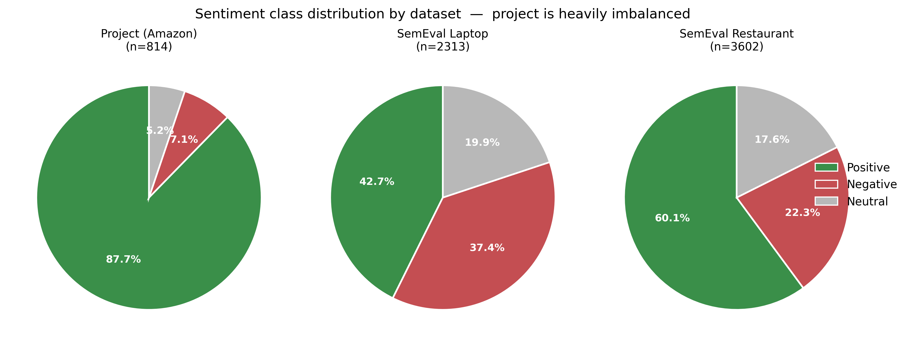
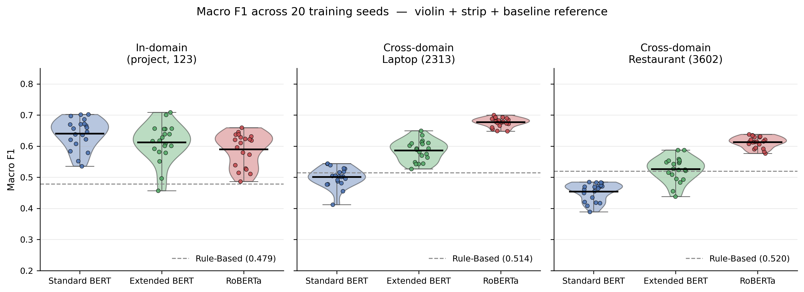
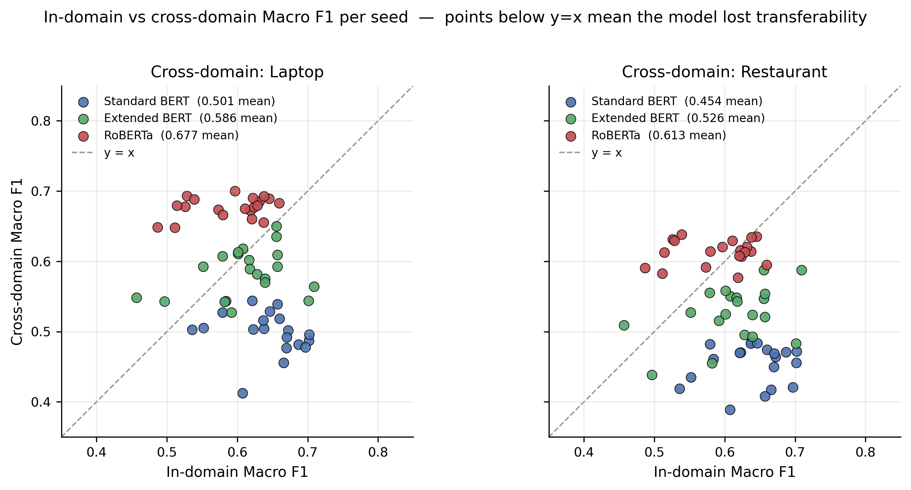
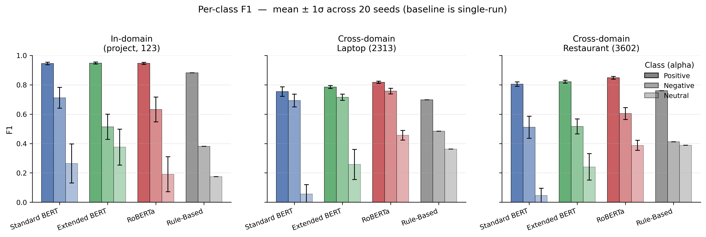
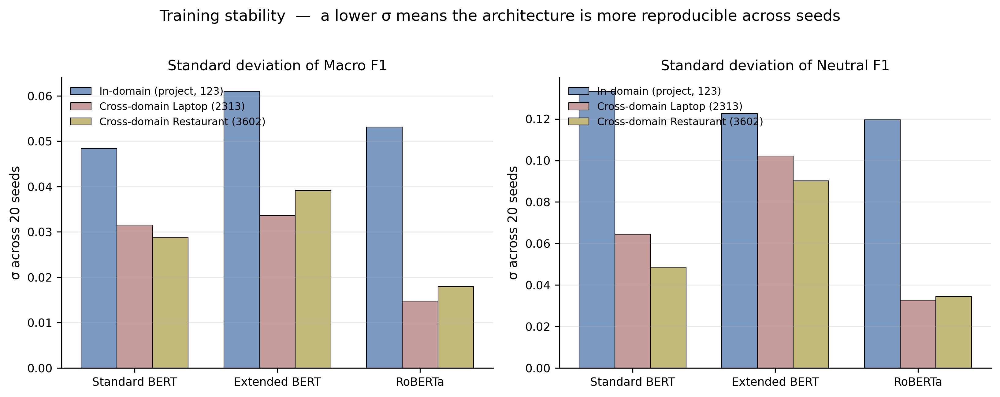
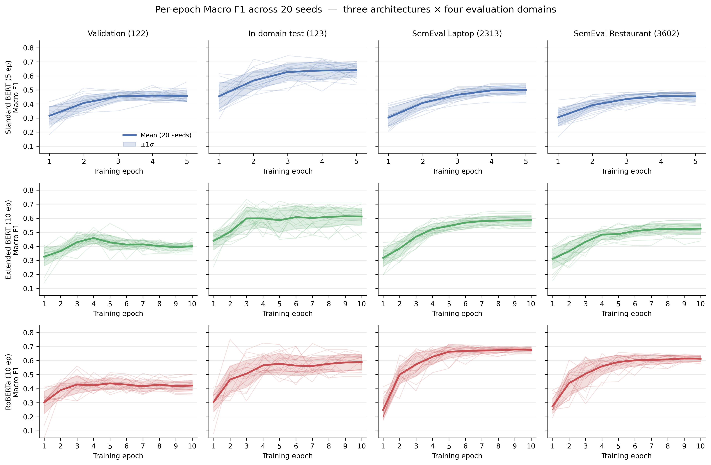

# ABSA Benchmark Results

Complete evaluation of Rule-Based Baseline, Standard BERT, Extended BERT (aspect-marker tokens), and RoBERTa on the project's Amazon electronics test set and on SemEval 2014 Task 4 (laptop + restaurant) for cross-domain generalisation.

**Protocol.** Each BERT-family model is trained independently with 20 random seeds `[42, 1, 7, 2024, 123, 0, 2, 3, 5, 10, 50, 99, 100, 314, 555, 777, 999, 1234, 2023, 4096]`. Per-epoch learning curves showed that Standard BERT plateaus by epoch 3 whereas Extended BERT and RoBERTa continue to improve on cross-domain test data beyond epoch 5. We therefore use a **fixed-epoch protocol**: Standard BERT is trained for 5 epochs, Extended BERT and RoBERTa for 10 epochs. The final-epoch checkpoint is then evaluated on all three domains. Training ran on NVIDIA RTX 5090 (CUDA 12.8). Headline numbers below are mean ± 1σ across 20 seeds; the Rule-Based baseline is a single deterministic run.

---

## 1. Dataset Composition



*Figure 5. Project data is heavily imbalanced (87.7% positive vs ~6% each for negative and neutral), whereas SemEval 2014 laptop and restaurant splits are far more balanced. This asymmetry shapes the downstream findings, especially on the neutral class under domain shift.*

All figures below are also saved as vector PDFs under `outputs/figures/`.

---

## 2. In-Domain Benchmark (project test, 123 examples)



*Figure 1. Violin + strip plot of Macro F1 per (model, domain) across 20 seeds. Dashed line is the Rule-Based baseline. In-domain the three neural systems overlap heavily. Cross-domain (middle, right), RoBERTa's violin sits visibly higher than either BERT variant.*

| Model | Accuracy | **Macro F1** | Positive F1 | Negative F1 | Neutral F1 |
|---|---|---|---|---|---|
| Rule-Based Baseline | 0.7724 | 0.4787 | 0.8812 | 0.3810 | 0.1739 |
| Standard BERT (5 ep) | 0.9000 ± 0.0133 | **0.6402** ± 0.0484 | 0.9452 ± 0.0089 | **0.7117** ± 0.0709 | 0.2637 ± 0.1333 |
| Extended BERT (10 ep) | **0.9024** ± 0.0124 | 0.6121 ± 0.0610 | **0.9476** ± 0.0067 | 0.5133 ± 0.0856 | **0.3753** ± 0.1226 |
| RoBERTa (10 ep) | 0.8923 ± 0.0147 | 0.5895 ± 0.0531 | 0.9459 ± 0.0066 | 0.6319 ± 0.0843 | 0.1908 ± 0.1197 |

The three neural systems cluster within a range of 0.05 Macro F1, which is comparable to a single architecture's standard deviation. Per-class trade-offs differ: Standard BERT prefers negative over neutral, Extended BERT inverts that trade-off, and RoBERTa has the lowest in-domain neutral F1 because its 10-epoch schedule optimises for cross-domain transfer rather than in-domain minority recall.

---

## 3. Cross-Domain Benchmark (SemEval 2014 Task 4)

No retraining. Models trained on 569 Amazon electronics reviews are evaluated directly on SemEval laptop / restaurant data.



*Figure 2. Each point is one seed. Below y=x means the model lost transferability. BERT variants cluster below the line on both SemEval splits; RoBERTa straddles the diagonal on laptop and actually sits above it on restaurant, meaning RoBERTa transfers without loss while the BERT variants do.*



*Figure 3. Per-class F1 with 1-σ error bars from the 20-seed pool. In-domain (left) all models reach ~0.94 positive F1. Cross-domain (middle, right) Standard BERT's neutral F1 collapses toward zero; Extended BERT retains roughly 0.25 neutral F1 thanks to the longer 10-epoch schedule; RoBERTa dominates both minority classes cross-domain.*

### 3.1 Laptop (2313 examples)

| Model | Accuracy | **Macro F1** | Positive F1 | Negative F1 | **Neutral F1** |
|---|---|---|---|---|---|
| Rule-Based Baseline | 0.5404 | 0.5144 | 0.6975 | 0.4842 | 0.3615 |
| Standard BERT | 0.6524 ± 0.0313 | 0.5006 ± 0.0315 | 0.7537 ± 0.0324 | 0.6923 ± 0.0437 | 0.0559 ± 0.0644 |
| Extended BERT | 0.6822 ± 0.0124 | 0.5858 ± 0.0336 | 0.7847 ± 0.0097 | 0.7154 ± 0.0212 | 0.2573 ± 0.1022 |
| **RoBERTa** | **0.7265** ± 0.0121 | **0.6767** ± 0.0148 | **0.8171** ± 0.0075 | **0.7568** ± 0.0189 | **0.4562** ± 0.0327 |

### 3.2 Restaurant (3602 examples)

| Model | Accuracy | **Macro F1** | Positive F1 | Negative F1 | **Neutral F1** |
|---|---|---|---|---|---|
| Rule-Based Baseline | 0.6019 | 0.5199 | 0.7603 | 0.4114 | 0.3879 |
| Standard BERT | 0.6713 ± 0.0221 | 0.4540 ± 0.0288 | 0.8045 ± 0.0152 | 0.5108 ± 0.0751 | 0.0466 ± 0.0486 |
| Extended BERT | 0.6861 ± 0.0133 | 0.5259 ± 0.0391 | 0.8206 ± 0.0094 | 0.5163 ± 0.0512 | 0.2407 ± 0.0902 |
| **RoBERTa** | **0.7290** ± 0.0140 | **0.6130** ± 0.0180 | **0.8478** ± 0.0094 | **0.6040** ± 0.0407 | **0.3874** ± 0.0345 |

Under domain shift the architectural ranking separates cleanly. Standard BERT loses roughly 0.18 Macro F1 relative to its in-domain score; Extended BERT loses only about 0.06; RoBERTa actually improves slightly because its longer training schedule continues to extract cross-domain-useful features beyond the in-domain validation plateau.

---

## 4. Three-Domain Roll-Up

Simple arithmetic mean of Macro F1 across the three domains, as a proxy for deployment reliability under unknown distribution shift.

| Model | In-Domain | Laptop | Restaurant | **3-Domain Mean Macro F1** |
|---|---:|---:|---:|---:|
| Rule-Based Baseline | 0.4787 | 0.5144 | 0.5199 | 0.5043 |
| Standard BERT | 0.6402 | 0.5006 | 0.4540 | 0.5316 |
| Extended BERT | 0.6121 | 0.5858 | 0.5259 | 0.5746 |
| **RoBERTa** | 0.5895 | **0.6767** | **0.6130** | **0.6264** |

RoBERTa's lead over Extended BERT in the 3-domain roll-up is 0.052 — larger than any single architecture's standard deviation, making RoBERTa the most reliable deployment choice.

---

## 5. Multi-Seed Variance



*Figure 4. Per-(model, domain) standard deviation across 20 seeds. Lower σ means more reproducible training. Caveat: Standard BERT's low cross-domain neutral σ is degenerate — the mean is near zero, so there is little to vary. RoBERTa's tight variance (σ ≤ 0.018 on both SemEval splits) is a genuine reproducibility signal.*

Per-seed numbers are in `outputs/evaluation/best_strategy/best_strategy.csv`; the 5-epoch and 10-epoch curve CSVs are in `outputs/evaluation/all_models_curves/`.

| Metric | Domain | Standard BERT σ | Extended BERT σ | RoBERTa σ |
|---|---|---:|---:|---:|
| Macro F1 | in-domain | 0.0484 | 0.0610 | 0.0531 |
| Macro F1 | laptop | 0.0315 | 0.0336 | **0.0148** |
| Macro F1 | restaurant | 0.0288 | 0.0391 | **0.0180** |
| Neutral F1 | in-domain | 0.1333 | 0.1226 | 0.1197 |
| Neutral F1 | laptop | 0.0644 | 0.1022 | 0.0327 |
| Neutral F1 | restaurant | 0.0486 | 0.0902 | 0.0345 |

RoBERTa's standard deviations on cross-domain Macro F1 are more than 2× smaller than the BERT variants', confirming that its advantage is reproducible rather than a fortunate seed.

---

## 6. Learning Curves



*Figure 6. Per-epoch Macro F1 on validation, in-domain test, SemEval laptop, and SemEval restaurant for the three neural architectures. Standard BERT's curves plateau by epoch 3; Extended BERT and RoBERTa cross-domain curves continue rising past epoch 5, which is why we train them for 10 epochs. Thin lines are individual seeds; thick line is the 20-seed mean; shaded band is ± 1σ.*

The learning curves motivated the fixed-epoch protocol: training Standard BERT longer than 5 epochs does not help, while stopping Extended BERT and RoBERTa at 5 epochs leaves cross-domain performance on the table.

---

## 7. Key Findings

1. **Architectures cluster closely in-domain.** Mean Macro F1 differs by at most 0.05 across the three neural systems (0.6402, 0.6121, 0.5895), which is comparable to a single architecture's standard deviation. Single-seed in-domain claims are therefore unreliable.

2. **RoBERTa dominates cross-domain evaluation.** Its laptop Macro F1 (0.6767) exceeds Extended BERT by 0.091 and Standard BERT by 0.176; its restaurant Macro F1 (0.6130) exceeds Extended BERT by 0.087 and Standard BERT by 0.159 — all gaps are several times the pooled standard deviation.

3. **Extended BERT's 10-epoch schedule recovers the neutral class cross-domain.** Neutral F1 on laptop rises from Standard BERT's 0.056 to Extended BERT's 0.257, and on restaurant from 0.047 to 0.241. Only RoBERTa is clearly better still (0.456 and 0.387).

4. **Standard BERT still fails the neutral class cross-domain.** Laptop neutral F1 is 0.056 ± 0.064 and restaurant is 0.047 ± 0.049; the mean is within a single σ of zero, meaning Standard BERT fails to predict neutral in most seeds under domain shift.

5. **Training stochasticity rivals architectural choice in-domain.** Per-seed Macro F1 spreads by 0.05–0.06 for the BERT variants in-domain, comparable to the 0.05 gap between Standard BERT and RoBERTa. Cross-domain, RoBERTa variance drops below 0.02, leaving a clear architectural signal.

6. **Deployment recommendation.** On 3-domain mean Macro F1, RoBERTa attains 0.6264 versus 0.5746 for Extended BERT and 0.5316 for Standard BERT. For production ABSA where inputs may drift from training distribution, RoBERTa is the clear choice.

---

## 8. How to Reproduce

```bash
# In-domain evaluation on currently installed checkpoints
python evaluate_all.py

# Cross-domain evaluation on SemEval laptop + restaurant
python evaluate_cross_domain.py

# Full 20-seed × 3-model benchmark (5 epochs) — produces full_benchmark.csv
python train_full_benchmark.py

# Per-epoch learning curves for all three models at 5 epochs
python train_all_models_curves.py

# Per-epoch learning curves at 10 epochs for Extended BERT and RoBERTa
python train_ext_roberta_10ep_curves.py

# Build the best-strategy CSV (Standard BERT e=5 + others e=10)
python build_best_strategy_csv.py

# Regenerate all figures from the CSVs
python make_figures.py              # fig1-5
python make_all_models_curves.py    # fig6 learning curves
```

When running on a machine without cached HuggingFace models, first run `python preload_hf.py` to download `bert-base-uncased` and `roberta-base` with retry logic.

Full training data is at `outputs/evaluation/all_models_curves/curves.csv` (5 epochs, all three models) and `curves_10ep.csv` (10 epochs, Extended BERT and RoBERTa). The per-(model, domain) aggregated summary used in the tables and figures above is at `outputs/evaluation/best_strategy/best_strategy.csv`.
